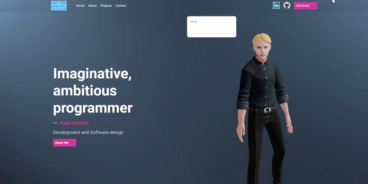

# Portfolio


**Made by: Aapo Soukkio**

***

## About the project

A responsive multi-page portfolio



### Features

- Various 3D-models with animations
- Fully working Contact page 
- User friendly snap scroll 
- Smooth page change
- Animated text styling

### Technologies Used

- React
- Styled Components
- WebGL and Three.js
- Vite

### Getting Started

To run the project:

1. Clone the repository: Start by cloning the repository to your local machine.

2. Install dependencies: Navigate to the project directory and install the necessary dependencies using a package manager like npm or yarn:
```
npm install
```
or
```
yarn install
```

3. Run the development server: Start the development server to run the React application locally:
```
npm start
```
or
```
yarn run dev
```

4. View the application: Open your web browser and visit http://127.0.0.1:5174/ or whatever URL your terminal window will suggest you to open

### Notes

- Contact form uses EmailJS and in order to work needs Service Id, Template Id and Public key. You can get it running here  --> https://www.emailjs.com/
## Helpful Links

> **Following material will help to understand this project and learn more about techniques used in this project.**


- https://threejs.org/
- https://styled-components.com/
